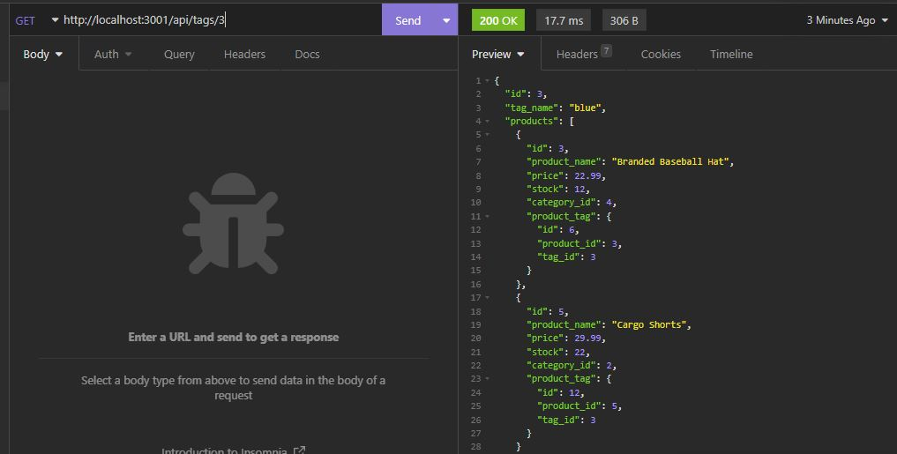
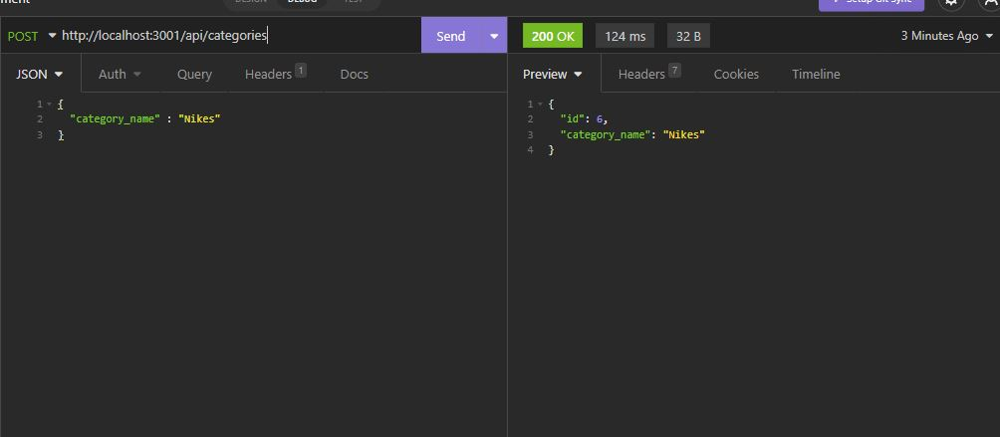

# E-Commerce Terry Kim
E-Commerce Application by Terry Kim

This application uses a backend function to store databases. The database will connect with sequalize, uses express, MYSQL to create the database and get routes for the application.
The following is what the database will create:

-Categories

-Products

-Tags

Once the npm or node is started and the server from localhost is running, we can use Insomnia to see the results.

## Screenshots

Live Video Demo: https://drive.google.com/file/d/1ZoPIx0-YiLs7w1N8o-nGfiA1G8jdl4hS/view

## Authors

- [@Terry Kim](https://github.com/TeryKing)

## Acknowledgements

Georgia Tech Coding Bootcamp: https://bootcamp.pe.gatech.edu/coding/

W3Schools: https://www.w3schools.com/

MDN : https://developer.mozilla.org/en-US/

Readme.so: https://readme.so/

NPMJS: https://www.npmjs.com/
## Feedback

If you have any feedback, please reach out to me at Tery_x3@hotmail.com

